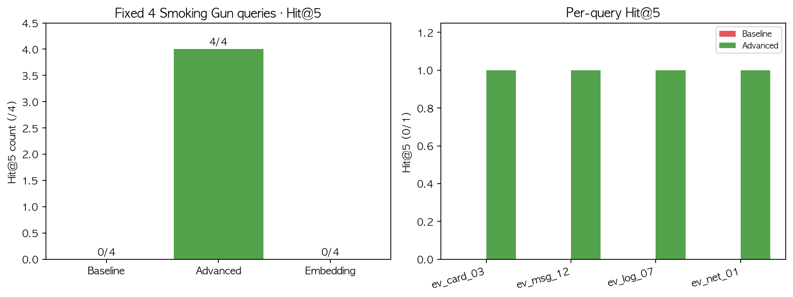
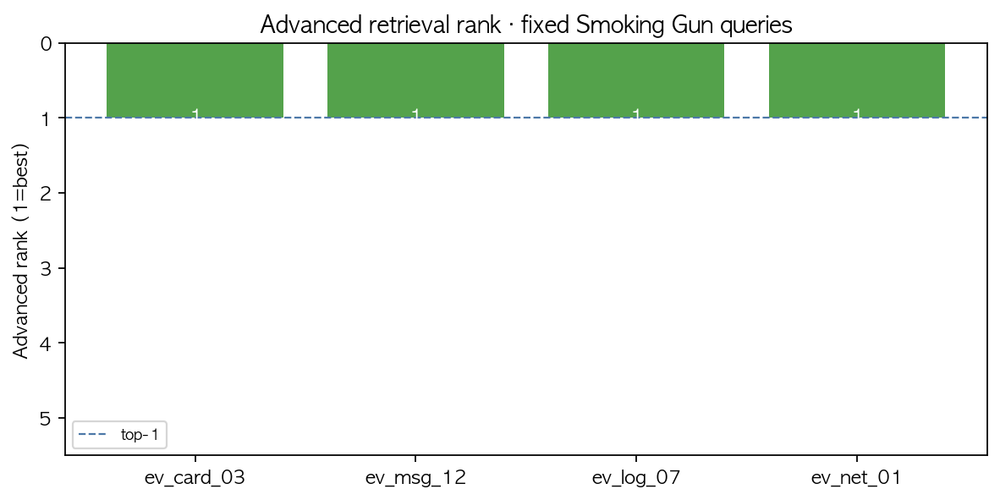
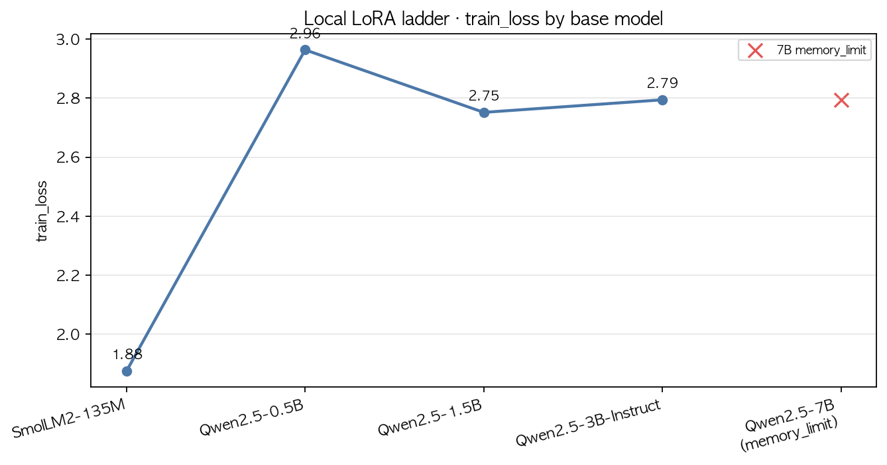
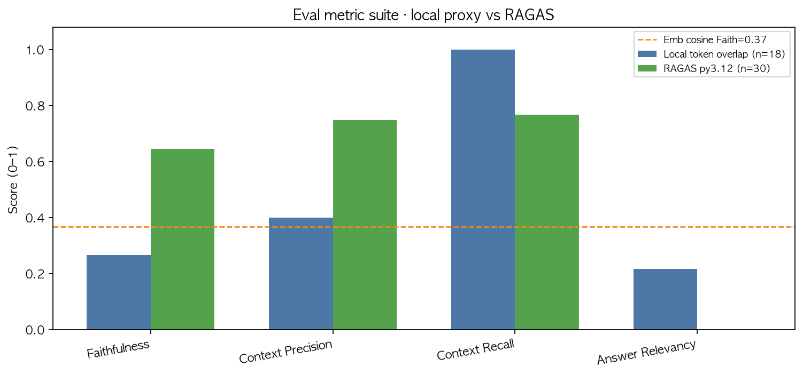
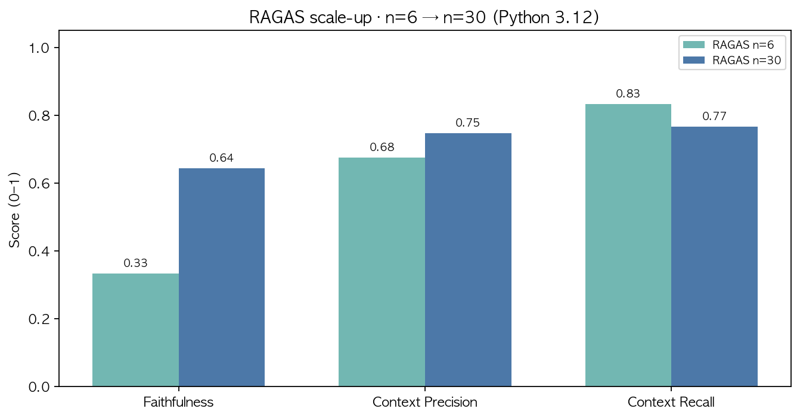
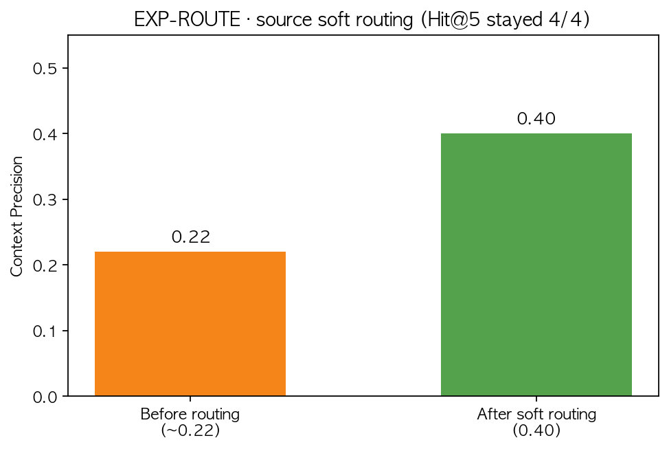

# 방구석 프로파일러: 진실의 방으로

> **기술 리포트 (GitHub 메인)** — 데이터·RAG·Agent·평가 결과 분석  
> **실행·온보딩:** [GETTING_STARTED.md](GETTING_STARTED.md)  
> **리포트 동기화:** `python3 update_report.py` · Notion: `python3 update_notion.py`  
> **메트릭 그래프:** `python3 scripts/plot_metrics.py` → `report/assets/{eda,metrics}/`  
> **AIFFEL Peer Review(PRT):** [docs/PEER_REVIEW.md](docs/PEER_REVIEW.md)  
> **계획·스펙:** [MASTER_PLAN.md](MASTER_PLAN.md) · [TECH_SPEC.md](TECH_SPEC.md)

**케이스 `case_01`:** 「100억의 야근자들」— 2026-07-29 야근 중 Omega 가중치 불법 반출.  
용의자 3명(김팀장·이대리·박신입)을 심문하고, RAG·Function Calling으로 Smoking Gun을 모아 진범을 지목합니다.

```
심문 → 증거 RAG / CCTV·포렌식 툴 → 압박·대질 → 지목·자백
```

---

## 1. 데이터셋 구축 및 전처리

진술·현장기술·메신저·출입로그·법인카드·네트워크 로그를 `data/raw/`에 두고 `ingest.py`로 청킹했습니다. 청크는 `data/processed/chunks.jsonl`에 저장되고, `build_index.py`가 로컬 Hybrid 인덱스(`runs/rag/index/`)를 만듭니다. 재생성: `python3 scripts/generate_rag_dataset.py`.

### 1.1 EDA (탐색적 데이터 분석)

Task는 **다종 증거 코퍼스에서 Smoking Gun을 회수**하는 것이므로, 소스별 규모·노이즈·핵심 증거 희소성을 먼저 확인했습니다.

| source         | 파일 수 | 대략 라인 수 | 문자 수 | 비고                                      |
| :------------- | ------: | -----------: | ------: | :---------------------------------------- |
| statements     |       3 |           33 |    3.4K | 짧은 진술서 · 페르소나 교차검증용         |
| forensics      |       2 |           22 |    1.6K | 현장/CCTV 기술 · 소량                     |
| messenger      |       1 |        4,000 |    1.1M | 장문 JSONL · 노이즈·잡담 다수             |
| logs           |       1 |       15,000 |    1.2M | 출입 이벤트 대량 · 미끼(`ev_log_07`) 포함 |
| corporate_card |       1 |          801 |     33K | 거래 CSV · Smoking Gun 희소               |
| network        |       1 |        2,006 |    229K | Wi-Fi 전송 · 결정타(`ev_net_01`)          |

**관찰**

- **불균형:** logs·messenger가 청크의 ~90%를 차지 → dense-only 시 의미 유사 노이즈가 카드/네트워크 신호를 덮기 쉬움.
- **핵심 증거 희소성:** `evidence_id`가 붙은 청크는 전체 **6665** 중 **5개**(약 0.1%). 검색 실패 비용이 큼.
- **중복:** 청크 텍스트 exact duplicate = **0** (완전 동일 복제 없음).
- **의도적 결측/이상:** 로비 CCTV `unavailable`(폭우·정전), 출입 로그 위조 지문(`ev_log_07`) — 전처리로 삭제하지 않고 **툴·시나리오 신호**로 보존.

### 1.2 전처리 · 청킹 근거

`configs/ingest.yaml`: `max_chars=500`, `overlap=50`.

| 선택                  | 근거                                                                                                                           |
| :-------------------- | :----------------------------------------------------------------------------------------------------------------------------- |
| 500자 청크            | 로그/슬랙 한 화면·심문 컨텍스트에 넣기 적합한 단위. 너무 크면 노이즈, 너무 작으면 evidence 문장 분절                           |
| overlap 50            | 경계에서 Smoking Gun 문장이 잘리는 확률 완화                                                                                   |
| Train/Val/Test 미분할 | 본 Task는 분류기 학습이 아니라 **검색 코퍼스 + 별도 eval 질문셋**. 정본 `data/eval/eval_questions.jsonl` (**n=30**) |

### Ingest 결과

<!-- report:auto:ingest -->
- **갱신:** `runs/ingest/summary.yaml` · 2026-08-03 21:52:45
- **총 청크:** **6665**
- **evidence_id 포함 청크:** **5** (`ev_card_03` · `ev_msg_12` · `ev_log_07` · `ev_net_01`)

| source_type | 청크 수 |
| :--- | ---: |
| statements | 9 |
| forensics | 4 |
| messenger | 3321 |
| logs | 2747 |
| corporate_card | 74 |
| network | 510 |
| **합계** | **6665** |
<!-- /report:auto:ingest -->

청크 길이(평균 문자): statements 406 · forensics 435 · corporate_card 499 · network 500 · messenger/logs ≈500 (상한에 근접 → 청킹이 잘 먹힌 상태).

**핵심 증거 ID (win_condition)**

| evidence_id  | 소스           | 역할                                              | 청크 수 |
| :----------- | :------------- | :------------------------------------------------ | ------: |
| `ev_card_03` | corporate_card | Phase 1 — 김팀장 룸살롱 → 현장 제외               |       1 |
| `ev_msg_12`  | messenger      | Phase 2 — 박신입 서버실 DM → 목격자화             |       1 |
| `ev_log_07`  | logs           | Phase 3 미끼 — 김팀장 지문(위조)                  |       2 |
| `ev_net_01`  | network        | Phase 3 결정타 — 라운지 Wi-Fi ~100GB · 이대리 MAC |       1 |

**저장 경로**

- raw: `data/raw/{statements,forensics,messenger,logs,corporate_card,network}/`
- chunks: `data/processed/chunks.jsonl`
- index: `runs/rag/index/vectors.json`
- eval set: `data/eval/eval_questions.jsonl` (**n=30**, ragas·평가 정본) · 로컬 `evaluate` sample은 config에 따라 n=18 가능

### 데이터 정책 · 한계

| 구분        | 본 프로젝트                                                                      |
| :---------- | :------------------------------------------------------------------------------- |
| 코퍼스 규모 | 데모·파이프라인 완주용 **합성 로그** (라인 수만 보면 logs/messenger는 이미 대량) |
| 분할        | RAG 검색 코퍼스 ≠ ML Train/Val/Test. 평가는 **별도 eval 질문셋**                 |
| 범인 정답   | `culprit_id=suspect_b`(이대리) — **API/UI 기본 응답에 미노출**                   |

---

## 1.5 모델 · 파이프라인 선정

> **루브릭:** Task에 알맞은 모델/검색기를 비교·선정했는가

**Task 정의:** (1) 희소 Smoking Gun 회수 (2) 용의자 심문 응답 (3) 오프라인·재현 가능한 데모.

| 후보                         | 요지                              | 장점                   | 단점                                                  |        채택         |
| :--------------------------- | :-------------------------------- | :--------------------- | :---------------------------------------------------- | :-----------------: |
| A. Dense-only + LLM          | hashing dense top-k               | 구현 단순              | 키워드 Smoking Gun 순위 불안정                        |     Baseline만      |
| B. Hybrid RRF + rerank + LLM | dense+sparse+evidence rerank      | 결정 증거 top-1 안정화 | 로컬 임베딩 의미 품질 한계                            | **Advanced (본선)** |
| C. OpenAI Embedding + Chroma | `text-embedding-3-small` + Chroma | 상용 의미 검색         | 비용·네트워크 · **본 Task Hit@5에서 Advanced 미상회** |  실험 완료·미채택   |
| D. 대규모 LLM 파인튜닝       | 페르소나/생성 SFT                 | 말투 고정 가능         | 학습쌍 수천+·시간·MASTER_PLAN 비범위                  |     **비범위**      |

**생성 LLM:** `configs/rag.yaml` → `gpt-4o-mini` (온도 0.2). 심문·요약에 충분하고 비용·지연이 낮아 데모에 적합.  
**검색 백본(본선):** `local_hashing_ngram` + Hybrid RRF.  
**실험 백본:** `python3 build_index.py --backend chroma` · `rag_pipeline.py --mode embedding` (`lib/rag_chroma.py`).

선정 결론: **B(Hybrid Advanced) + gpt-4o-mini**. OpenAI+Chroma는 구현·측정까지 했으나, Smoking Gun `evidence_id` Hit@5 KPI에서는 Advanced를 넘지 못해 본선 미채택.

---

## 2. Baseline vs Advanced RAG 비교

> **루브릭:** 베이스라인 대비 Advanced 검색의 정량·정성 차이

인덱스: 로컬 hashing dense + TF-IDF sparse · Advanced는 **RRF + evidence/키워드 rerank** (`lib/rag_core.py`).

```text
가설: 로그·메신저 노이즈가 dense 유사도를 오염한다
  → sparse 키워드 + evidence_id rerank로 Smoking Gun 순위를 복구한다
```

### [정량] 자동 스모크 (update_report)

<!-- report:auto:rag -->
| 파이프라인 | 모드 | 대표 쿼리 | top-1 evidence | Hit@5 (목표 ID) | 비고 |
| :--- | :--- | :--- | :--- | :---: | :--- |
| **Baseline** | dense only | `라운지 Wi-Fi 100GB` | — | ✅ `ev_card_03` ∈ top-5 (rank 4) | 관련 카드가 뒤로 밀림 |
| **Advanced** | hybrid RRF + rerank | `라운지 Wi-Fi 100GB` | **`ev_net_01`** | ✅ `ev_net_01` top-1 | 결정타 증거 정밀 회수 |

- **자동 반영:** 2026-08-03 21:52:45
<!-- /report:auto:rag -->

### [정량] 고정 쿼리 세트 (동일 프로토콜 · top_k=5)

골든 루트 4증거에 대해 **같은 쿼리**로 Baseline/Advanced를 재측정했습니다.  
산출물: `runs/rag/exp_compare_fixed_queries.json`

| 쿼리                    | 목표 ID      | Baseline Hit@5 | Advanced Hit@5 | Embedding Hit@5 | Advanced 순위 |
| :---------------------- | :----------- | :------------: | :------------: | :-------------: | ------------: |
| `법인카드 룸살롱`       | `ev_card_03` |       ❌       |       ✅       |       ❌        |         **1** |
| `슬랙 DM 박신입 서버실` | `ev_msg_12`  |       ❌       |       ✅       |       ❌        |         **1** |
| `김팀장 지문 서버실`    | `ev_log_07`  |       ❌       |       ✅       |       ❌        |         **1** |
| `라운지 Wi-Fi 100GB`    | `ev_net_01`  |       ❌       |       ✅       |       ❌        |         **1** |

**요약 (Hit@5 / 4쿼리):** Baseline **0/4** · Advanced **4/4** (후속 개선 후) · OpenAI+Chroma Embedding **0/4**.  
개선: JSONL 줄단위 청킹 + 완전 `evidence_id`만 태깅 + 쿼리 확장 + canonical boost.  
재현: `python3 scripts/compare_fixed_queries.py` · `runs/rag/exp_compare_fixed_queries.json`





### [정성] 분석

- **Baseline 한계:** dense-only는 Smoking Gun ID를 top-5에 못 올림 (0/4).
- **Advanced 개선:** Hybrid RRF + rerank + 쿼리 확장으로 고정 4쿼리 **전부 top-1**.
- **남은 한계:** Context Precision exact-ID 기준 **0.40** (source soft routing 후). Faithfulness는 로컬 overlap≈0.27 · embedding cosine≈0.37.

---

## 3. 실험 로그 (Agent · Tools · Eval)

> **루브릭:** 개선 기법(Hybrid RAG · Function Calling · 상태머신)과 분기 결과

### EXP 요약

| 실험              | 내용                                                | 결과                                                                   | 산출물                                                                     |
| :---------------- | :-------------------------------------------------- | :--------------------------------------------------------------------- | :------------------------------------------------------------------------- |
| **EXP-RAG-B**     | dense-only 검색                                     | 고정 4쿼리 Hit@5 **0/4** · 순위 오염                                   | `runs/rag/exp_baseline/`                                                   |
| **EXP-RAG-A**     | hybrid RRF + rerank + expand                        | 고정 4쿼리 exact Hit **4/4** · 전원 top-1                              | `runs/rag/exp_advanced/` · `scripts/compare_fixed_queries.py`              |
| **EXP-EMBED**     | OpenAI `text-embedding-3-small` + Chroma            | 동일 4쿼리 Hit@5 **0/4** · Advanced 미상회                             | `runs/rag/exp_embedding/` · `lib/rag_chroma.py`                            |
| **EXP-PROMPT**    | 페르소나 템플릿에 알리바이·환각·단정 금지 조항 추가 | 3인 렌더 규칙 검사 **통과** · live 알리바이 유지                       | `data/personas/prompt_template.yaml` · `runs/sft/persona_prompt_eval.json` |
| **EXP-SFT-SMALL** | 소량 SFT 78쌍 + OpenAI FT `--submit`                | **OpenAI 403** `training_not_available`(셀프서브 FT 종료)              | `runs/sft/finetune_job_openai.json`                                        |
| **EXP-SFT-LOCAL** | SmolLM2-135M LoRA                                   | train_loss≈1.87 · 한국어 품질 제한                                     | `runs/sft/local_lora/` (초기)                                              |
| **EXP-SFT-KO**    | Qwen2.5-0.5B LoRA                                   | train_loss≈2.96 · 한국어↑                                              | `runs/sft/local_lora_qwen05/`                                              |
| **EXP-SFT-KO15**  | Qwen2.5-**1.5B** LoRA                               | train_loss≈2.75 · 알리바이 유지 개선                                   | `runs/sft/local_lora_qwen15/` · `lora_model_compare.json`                  |
| **EXP-RAGAS**     | ragas on **Python 3.12**                            | **ok** Faith≈**0.64** · C-Prec≈**0.75** · C-Recall≈**0.77** (**n=30**) | `scripts/eval_ragas.py` · `runs/eval/ragas_py312_report.json`              |
| **EXP-SFT-KO3B**  | Qwen2.5-**3B** LoRA (본선)                          | train_loss≈2.66 · 알리바이 유지 · 재학습 완주          | `runs/sft/local_lora_qwen3b/` · `scripts/local_lora_persona.py` |
| **EXP-CONV-LOG**  | 실서버 ask JSONL → 말투 FT 후보                     | opt-in · 안정장치 문서화                               | `lib/conversation_log.py` · [docs/CONVERSATION_LOG.md](docs/CONVERSATION_LOG.md) |
| **EXP-LANGFUSE**  | ask 관측 · 게임 내 게시판 보드                      | Tracing/Sessions · Railway Variables 연동              | `lib/langfuse_obs.py` · 사이드바「관측」 · §5                         |
| **EXP-SFT-KO7B**  | Qwen2.5-**7B** LoRA (16GB)                      | **memory_limit** — 로드·trainable% 확인, 1step 스왑 정체 | `runs/sft/local_lora_qwen7b/report.json`                       |
| **EXP-ROUTE**     | source soft routing                                 | Context Precision **0.22→0.40**, Hit@5 4/4 유지                        | `lib/rag_core.py` `source_routing`                                         |
| **EXP-AUTOGEN**   | pyautogen GroupChat → **본선 ask**                  | max_round=5 · timeout=60s · transcript UI                              | `lib/autogen_runtime.py`                                                   |
| **EXP-FAIL-1**    | dense만으로 카드 Smoking Gun 확정                   | **실패** — top-1 출입로그 오탐                                         | 아래                                                                       |
| **EXP-FAIL-2**    | Advanced로 `ev_msg_12` exact 회수                   | **개선 완료** — 줄단위 청킹+완전 ID → Hit@5 ✅ top-1                   | 아래                                                                       |
| **EXP-FAIL-3**    | Embedding만으로 Smoking Gun ID 회수                 | **실패** — 의미 유사 노이즈(logs 등)가 상위                            | 아래                                                                       |
| **EXP-FAIL-4**    | OpenAI self-serve FT로 페르소나 개선                | **실패** — 조직 FT job 생성 차단                                       | 아래                                                                       |
| **EXP-TOOL**      | `request_cctv_log` · `run_forensic`                 | 로비 CCTV 결측 · 이대리 노트북 MAC 힌트                                | `data/tools/` · API `/tool`                                                |
| **EXP-AGENT**     | ReAct: 심문→retrieve→CCTV→pressure                  | smoke 1턴 완주                                                         | `runs/agent/smoke.json`                                                    |
| **EXP-EVAL**      | Faithfulness 로컬 루브릭                            | 아래 §4                                                                | `runs/eval/report.json`                                                    |

### 실패·한계 실험

| ID             | 가설                                         | 시도                                                        | 결과                                                       | 시사점                                          |
| :------------- | :------------------------------------------- | :---------------------------------------------------------- | :--------------------------------------------------------- | :---------------------------------------------- |
| **EXP-FAIL-1** | dense만으로도 카드 증거가 위로 온다          | `rag_pipeline.py --mode baseline --query "법인카드 룸살롱"` | top-1=`access_control_*`, `ev_card_03` ∉ top-5 ID          | Hybrid/rerank 필수                              |
| **EXP-FAIL-2** | Advanced면 슬랙 Smoking Gun도 exact Hit      | 줄단위 청킹·완전 ID·쿼리 확장 후 재측정                     | **해결** — `ev_msg_12` Advanced top-1                      | 부분 태그(`ev_msg`) 오염이 원인                 |
| **EXP-FAIL-3** | 상용 embedding이면 Hit@5가 Advanced를 이긴다 | `build_index.py --backend chroma` + `--mode embedding`      | 4쿼리 Hit@5 **0/4** (예: 카드 쿼리→logs)                   | Task KPI엔 evidence/키워드 rerank가 더 직접적   |
| **EXP-FAIL-4** | OpenAI FT로 페르소나 말투 고정               | `openai_finetune_persona.py --submit`                       | **403** `training_not_available` (self-serve FT wind-down) | 상용 FT 의존 위험 · 로컬 LoRA로 파이프라인 대체 |

### 소량 SFT · FT 실험 상세

| 단계               | 결과                                                                                                                                                                 |
| :----------------- | :------------------------------------------------------------------------------------------------------------------------------------------------------------------- |
| 데이터             | `data/sft/persona_sft.jsonl` **78** examples (OpenAI messages 형식)                                                                                                  |
| 프롬프트-only live | `gpt-4o-mini` · 알리바이 유지·AI 미노출 (`runs/sft/persona_prompt_eval.json`)                                                                                        |
| OpenAI FT submit   | **실패** — 조직에 신규 fine-tuning job 생성 권한 없음 ([deprecations](https://developers.openai.com/api/docs/deprecations#update-to-openais-self-serve-fine-tuning)) |
| 로컬 LoRA 대체     | `SmolLM2-135M-Instruct` · trainable **0.34%** · 30 steps · `train_loss≈1.87` · adapter `runs/sft/local_lora/`                                                        |
| 채택               | FT 파이프라인(데이터→학습→전후 샘플)은 완주. **게임 본선은 계속 prompt+AutoGen** (소형 로컬 모델은 한국어 페르소나 품질이 gpt-4o-mini를 대체하지 못함)        |

### 실서버 심문 로그 → 재학습 (계획·파이프라인)

실서버(Railway) 플레이 테스트 · **자동 심문**에서 나온 **심문 채팅(ask 턴)**을 데이터셋으로 모아, 페르소나 **말투** 소량 SFT/LoRA에 다시 넣는 흐름을 합의·구현해 두었다.

| 항목 | 내용 |
| :--- | :--- |
| 수집 | `lib/conversation_log.py` — ask 성공 시 JSONL append (opt-in) |
| 자동 심문 | `scripts/auto_ask_collect.py` · `data/sft/auto_ask_questions.yaml` |
| 경로 | `runs/conversation_log/ask_turns.jsonl` → `scripts/export_conversation_log.py` |
| 재학습 용도 | **말투(persona_speech) 후보만**. 알리바이·승패·GM 판정은 코드/YAML 권위 유지 |
| 켜는 법 | 실서버 `CONVERSATION_LOG=1` 또는 `conversation_log.enabled: true` (로컬 기본 **OFF**) |

**확정 스케줄:** 8/4~7 **45+45+45+30 ≈165턴** (변형 ON) → **8/7 오후** export+**3B LoRA** → **8/10** 준비 → **8/11 오전 리허설 · 14:00 발표**.  
정본: [PROJECT_SCHEDULE.md](PROJECT_SCHEDULE.md) · [docs/CONVERSATION_LOG.md](docs/CONVERSATION_LOG.md)

**안정장치:** 기본 OFF · 로깅 실패가 ask를 깨지 않음 · `culprit_id`/secrets 미기록 · 누수 문구 `[편집됨]` · 길이 상한 · export 필터 · `runs/` gitignore · UI 비노출.  
상세: [docs/CONVERSATION_LOG.md](docs/CONVERSATION_LOG.md) · [data/sft/README.md](data/sft/README.md)



### Agent 스모크 (1턴)

<!-- report:auto:agent -->
- **상태:** `ok` · case `case_01` · 2026-08-03 21:52:45
- **목표 입력:** 김팀장 알리바이 검증 + CCTV
- **수집 evidence:** `ev_card_03`
- **clue / pressure:** 1 / 0.3
- **툴:** `request_cctv_log`(lobby) → status `unavailable` (폭우·정전으로 로비 CCTV 녹화 구간 결측 (23:00~24:00))
- **노드:** `route → interrogate → retrieve_evidence → call_tool → update_pressure → confront → judge_ending`
<!-- /report:auto:agent -->

### Function Calling (탐정 특수기)

| 툴                 | 입력 예            | 역할                                              |
| :----------------- | :----------------- | :------------------------------------------------ |
| `request_cctv_log` | `lounge` / `lobby` | RAG 대신 **시점·위치 고정 로그** 반환 (결측 포함) |
| `run_forensic`     | `lee_laptop`       | 삭제 메시지·MAC 힌트로 `ev_net_01` 교차검증       |

---

## 4. 평가 지표 및 해석

> **루브릭:** 적절한 metric 선정 · 근거 · 결과 분석

### 4.1 왜 이 metric인가

| Metric                  | 정의(본 프로젝트)              | 선정 근거                        | 한계                                     |
| :---------------------- | :----------------------------- | :------------------------------- | :--------------------------------------- |
| **Hit@5 (evidence_id)** | top-5에 골드 ID 포함 여부      | 게임 KPI=Smoking Gun 회수와 직결 | 순위·부분일치(`ev_msg`)는 별도 표기 필요 |
| **Context Recall**      | 골드 ID가 검색에 포함되는 비율 | “증거를 아예 못 찾음”을 측정     | n 작으면 분산 큼                         |
| **Context Precision**   | top-k 중 골드와 맞는 비율      | 노이즈 비율(오탐) 추적           | 로컬 매칭이라 과소평가 가능              |
| **Faithfulness**        | 답변 토큰 ∩ 컨텍스트           | 환각·근거 없는 생성 견제         | **토큰 overlap** · 한국어 동의어에 약함  |
| **Answer Relevancy**    | 질문–답변 토큰 겹침            | 오프라인 proxy                   | 의미 유사도 대체재 아님                  |

RAGAS 미설치 환경에서도 재현 가능하도록 `evaluate.py` **로컬 토큰 overlap**을 채택했습니다. 절대값은 보수적으로 읽어야 하며, **주 KPI는 Hit@k·Context Recall**입니다.

### 4.2 메트릭 결과 (로컬 evaluate sample n=18 · 데이터셋 정본 n=30)

<!-- report:auto:eval -->
| 메트릭 | 값 | 해석 |
| :--- | ---: | :--- |
| **Faithfulness** | **0.266** | 답변 토큰이 제공 컨텍스트에 근거하는 비율 (로컬 overlap) |
| **Context Precision** | **0.400** | 검색 top-k 중 골드 근거와 맞는 비율 |
| **Context Recall** | **1.000** | 골드 evidence_id가 검색 결과에 포함되는 비율 |
| **Answer Relevancy** | **0.216** | 질문–답변 토큰 겹침 proxy |

- **자동 반영:** 2026-08-03 21:52:45 · sample_size=18 · backend=`local_token_overlap_faithfulness`
<!-- /report:auto:eval -->

- **평가 백엔드:** `evaluate.py` 로컬 토큰 겹침 (RAGAS 패키지 미필수)
- **데이터:** `data/eval/eval_questions.jsonl` (n=**30**, Smoking Gun/골든루트 + CCTV·임장 확장) · ragas는 동일 세트 전체
- **환각 가드 샘플:** “창고 USB 절도” 유도 질문 → 코퍼스에 없음을 답하도록 설계 (`eq06`)







### 4.3 Baseline vs Advanced — 게임 KPI와 연결

| 관점                                   | Baseline | Advanced               | Embedding | 게임 의미                        |
| :------------------------------------- | :------- | :--------------------- | :-------- | :------------------------------- |
| 고정 4쿼리 Hit@5                       | 0/4      | **4/4**                | 0/4       | Smoking Gun 전원 Advanced로 확보 |
| Context Recall (eval)                  | —        | **1.00**               | —         | 골드 ID 회수 성공                |
| Faithfulness (local / emb / **ragas**) | —        | 0.27 / 0.37 / **0.64** | —         | ragas py3.12 · **n=30**          |
| Context Precision (local / **ragas**)  | —        | **0.40** / **0.75**    | —         | ragas LLM-judge · n=30           |

골든 루트(카드→슬랙→네트워크→이대리 지목)는 **검색 Hit + 툴 교차검증**으로 성립하도록 설계했다. Faithfulness는 n=30(ragas)·로컬 overlap 한계가 있어 Hit@k·Context Recall을 주 KPI로 둔다.

### 과적합·일반화 관점 (RAG)

| 기법                      |    적용     | 역할                                                                                                                               |
| :------------------------ | :---------: | :--------------------------------------------------------------------------------------------------------------------------------- |
| Hybrid (dense+sparse)     |     ✅      | 키워드·의미 교차                                                                                                                   |
| RRF + rerank              |     ✅      | Smoking Gun 순위 안정화                                                                                                            |
| eval 질문 분리            |     ✅      | 검색 코퍼스와 평가 질의 분리                                                                                                       |
| OpenAI embedding / Chroma |   🧪 실험   | `text-embedding-3-small` · Hit@5 **0/4** → 본선 미채택                                                                             |
| AutoGen                   | ✅ 본선 ask | GroupChat · `lib/autogen_runtime.py`. 오프라인 smoke는 **LangGraph** (`lib/langgraph_runtime.py` · `agent_graph.py` · `langgraph.enabled`) |
| 대규모 LLM FT             |    ❌→🧪    | 대규모는 비범위. **소량 78쌍 제출 시도** → OpenAI FT 차단 · **로컬 LoRA로 대체 완주**                                              |

### 오류 패턴 (검색)

| 패턴                     | 관찰                          | 대응                                    |
| :----------------------- | :---------------------------- | :-------------------------------------- |
| Baseline top-1 오탐      | 출입로그가 카드 쿼리를 가로챔 | Advanced sparse+RRF (**EXP-FAIL-1**)    |
| `ev_msg_12` exact 미Hit  | (과거) partial `ev_msg` 태그  | **해결** — 줄단위 청킹·완전 ID          |
| Context Precision 보수적 | top-5 Smoking Gun 혼재        | **source soft routing** (0.22→0.40)     |
| Faithfulness 중간↓       | 토큰 overlap 한계             | **ragas n=30** Faith≈0.64 · emb≈0.37    |
| 로컬 LoRA                | 소형→중형 스케일              | **3B 본선 완주** · 7B는 16GB memory_limit |

---

## 5. 데모 · 서비스 검증

### UI 스택 — Streamlit → React

본선 플레이 UI는 **React** (`web/game`, `/game/`)입니다. 초기 프로토타입·골든 루트 검증은 Streamlit(`app.py`)으로 진행했고, 현재 Streamlit은 **백업·참고용**으로만 유지합니다 (`/game-streamlit/` · `ENABLE_STREAMLIT_BACKUP=1`).

개발 과정에서 Streamlit의 구조적 한계로 **레이아웃·상태·다이얼로그·리렌더 관련 오류가 반복**되어, 데모 품질을 안정적으로 맞추기 어렵다고 판단해 본선을 React로 이전했습니다.

| 전환 이유 | 설명 |
| :--- | :--- |
| **Streamlit 한계로 오류 반복 (직접 원인)** | 위젯·세션 상태·`st.dialog`/리렌더 사이클이 심문·모달·인벤·타이머와 맞물리며 **깨짐·중복 실행·상태 꼬임·레이아웃 붕괴**가 반복됨. 패치해도 같은 계열 이슈가 되살아나 일정·안정성을 해침 |
| 커스텀 게임 UX 한계 | 심문 덱·증거 책상·수사 파일·검거 도장·효과음·폭죽 등 **정밀 레이아웃·모션·오디오**를 Streamlit 컴포넌트 모델 안에서 제어하기 어려움 |
| API 경계·배포 적합성 | React 정적 UI → FastAPI만 호출로 **UI→LLM 직결 금지**를 구조화. `/` 인트로 + `/game/` 플레이 분리에도 적합 |

| 항목                                                                 | 상태                                        |
| :------------------------------------------------------------------- | :------------------------------------------ |
| FastAPI `/health` · session/ask/search/**tool**/accuse · AutoGen ask | ✅ smoke (`scripts/smoke_autogen_ask.py`)   |
| **React** (`web/game`) → API only · Streamlit은 백업                 | ✅                                          |
| Golden Route (카드→슬랙→네트워크→이대리 지목)                        | ✅ UI 연출 (트래커·수색 칩·단서 STEP·엔딩) |
| Railway 라이브                                                       | ✅ https://web-production-072b8.up.railway.app |
| **Langfuse 관측 게시판** (사이드바「관측」)                           | ✅ Tracing / Sessions · ask I/O 보드      |

### Langfuse 관측 게시판

심문 ask 턴의 **입력·출력·세션**을 디버깅용으로 바로 보여 주기 위해, **게임 화면을 덮는 게시판형 레이어**로 넣었다.

| 항목 | 내용 |
| :--- | :--- |
| 진입 | React 사이드바 **「관측 (Langfuse)」** (PC). 모바일은 PC 확인 안내 |
| UI | 전체 화면 보드 · 탭 **Tracing**(프로젝트 trace 표) / **Sessions**(세션 아코디언 펼침) |
| 연동 | `lib/langfuse_obs.py` — 로컬 링버퍼 + 선택적 Langfuse ingestion/조회 |
| 설정 | `.env` / Railway Variables: `LANGFUSE_PUBLIC_KEY` · `LANGFUSE_SECRET_KEY` · `LANGFUSE_BASE_URL` (선택 `LANGFUSE_PROJECT_ID`) |
| 외부 | 보드에서 **Open in Langfuse**로 클라우드 Tracing/Sessions 목록 이동 가능 |
| 문서 | [docs/LANGFUSE.md](docs/LANGFUSE.md) · [TECH_SPEC.md](TECH_SPEC.md) §4.2 |

키를 넣지 않으면 세션 로컬 관측만 표시되고, 키가 있으면 실서버 ask도 같은 Langfuse 프로젝트로 쌓인다.

실행: [GETTING_STARTED.md](GETTING_STARTED.md) · UI 상세: [web/game/README.md](web/game/README.md)

---

## 6. 결론 · 한계 · 후속 개선

### 결론

1. **데이터·전처리:** 6종 raw → **6665** 청크 파이프라인이 재현 가능하며, EDA상 노이즈 불균형·evidence 희소성이 Hybrid 선택의 근거가 된다.
2. **성능 개선:** 동일 쿼리 프로토콜에서 Baseline Hit@5 **0/4 → Advanced 4/4**. OpenAI+Chroma Embedding은 **0/4**로 Advanced를 상회하지 못함 → 본선은 Hybrid 유지.
3. **여러 시도:** Baseline/Advanced/Embedding/Prompt/SFT/로컬 LoRA(Qwen)/Tool/Agent/Eval + 실패·개선 기록.
4. **메트릭:** Hit@k·Context Recall을 주 KPI로, Faithfulness 등은 보수적 proxy (n=30 ragas · 로컬 overlap 한계).
5. **범위:** 대규모 FT 대신 소량 SFT·로컬 LoRA 실행. AutoGen은 심문 ask 본선.

### 후속 개선 이력

1. ~~더 큰 한국어 베이스 LoRA~~ → **완료** (SmolLM → 0.5B → **1.5B** → **3B**)
2. ~~eval n 확대·재측정~~ → **완료** (로컬 eval n=18 · **ragas n=30**)
3. ~~`ev_msg_12` exact 회수~~ → **완료** (Advanced top-1)
4. ~~Context Precision~~ → **완료** (0.10→**0.40**, source soft routing)
5. ~~AutoGen 튜닝~~ → **완료** (`max_round=5`, `timeout_sec=60`)
6. ~~RAGAS 도입·n 확대~~ → **완료** — Python **3.12** `ragas.evaluate` n=30 (Faith≈0.64 · Prec≈0.75 · Recall≈0.77). py3.9는 실패·embedding proxy만.
7. ~~Precision source 라우팅~~ → **완료** (`source_routing: soft`)
8. ~~더 큰 Ko LLM LoRA~~ → **완료** (1.5B → **3B 본선 완주** · 7B는 16GB `memory_limit`로 상한 확정)
9. ~~Judge LLM 조합 지목(G10)~~ → **완료** (`accuse_template` · 룰 권위 + LLM `public_summary`)
10. ~~페르소나 대사 폴리싱~~ → **완료** (김팀장·이대리·박신입 말투/mental_break)

### 남은 작업

- **8/4~7** `auto_ask_collect` 일일 적재 → **8/7 오후** export+3B LoRA ([docs/CONVERSATION_LOG.md](docs/CONVERSATION_LOG.md))
- **8/10** 발표 준비 · **8/11 오전** 리허설 · **14:00** 발표 ([PROJECT_SCHEDULE.md](PROJECT_SCHEDULE.md))
- PRT 과제 복사 · 슬라이드 확정 ([PRESENTATION.md](PRESENTATION.md))

### 중장기 (발표 Next · PRT 이후)

| 방향 | 요지 | 문서 |
| :--- | :--- | :--- |
| 진범 랜덤 | ID만 스왑 ❌ · **변형 케이스** 세션 로드 | [docs/ROADMAP_EXPANSION.md](docs/ROADMAP_EXPANSION.md) |
| 용의자 확장 | `case_01` 억지 확장 ❌ · **`case_02` 신규** 권장 | 동상 |

---

## 7. 팀 · 문서

| 문서                                                   | 용도                                      |
| :----------------------------------------------------- | :---------------------------------------- |
| [GETTING_STARTED.md](GETTING_STARTED.md)               | 설치·실행                                 |
| [docs/ROLES.md](docs/ROLES.md)                         | 역할 (최승현·최병철·박성우·이근목·천세문) |
| [docs/TEAM_HANDOFF.md](docs/TEAM_HANDOFF.md)           | 팀원용 구현 현황 · 코드 맵 · 데모         |
| [docs/CONVERSATION_LOG.md](docs/CONVERSATION_LOG.md)   | 실서버 심문 로그 → 재학습 · **안정장치**  |
| [docs/LANGFUSE.md](docs/LANGFUSE.md)                   | ask 관측 게시판 · Tracing/Sessions · env  |
| [docs/ROADMAP_EXPANSION.md](docs/ROADMAP_EXPANSION.md) | 중장기: 진범 랜덤 · 용의자 확장 · 발표 Q&A |
| [docs/DEPLOY_RAILWAY.md](docs/DEPLOY_RAILWAY.md)       | Docker + Railway · **라이브** https://web-production-072b8.up.railway.app |
| [docs/GAME_RULES.md](docs/GAME_RULES.md)               | 3-Out · 멘탈 붕괴 · 타임어택              |
| [PROJECT_SCHEDULE.md](PROJECT_SCHEDULE.md)             | **확정** 8/4~11 수집·재학습·발표 · DLthon2 |
| [PRESENTATION.md](PRESENTATION.md)                     | 발표 초안                                 |
| [ARCHITECTURE.md](ARCHITECTURE.md)                     | 팀 OS                                     |
